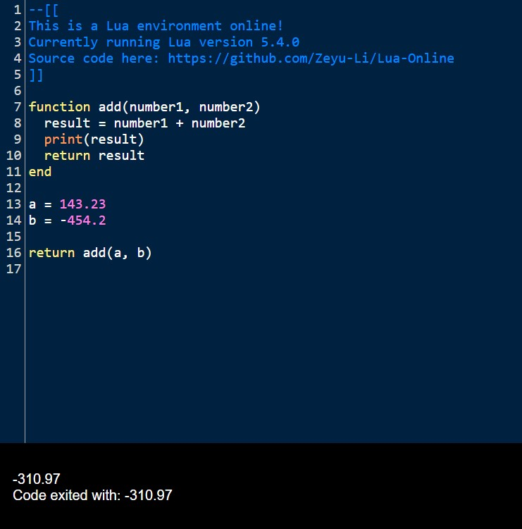

# WebAssembly Lua

WebAssembly for Lua Code editor website: https://zeyu-li.github.io/Lua-Online/


Forked from https://github.com/vvanders/wasm_lua -> https://github.com/Dreagonmon/wasm_lua

To remake do:

```sh
make all
```

To clean of all intermediate and final files use:

```sh
make clean
```

## Features

```lua
alert("Hello World!") 	-- works in creating an alert event in the browser
io.read() 				-- reads from browser with an alert popup (very buggy)
```

Infinite loops do not work because of js event loop


## Demo




# Files

* index.html: test page and usage example
* main.js: auto-generated js 
*  main.wasm: auto-generated binary 

### Webassembly

This is where you generate the webassemby binary and main.js if you decide to modify the lua code or update the webassembly in main.c and demolib.c

- main.c: export lua C function to javascript
- demolib.c: helper to main that enables alerts on the browser via `alert("Something")` when written in the textbox
- makefile: emcc config (which function to export, init function name, ...etc.)
- lua-5.40: lua source code without any modify except to the makefile

\* Technically, lua-5.4.0 and c files not needed to run file as the main.wasm is the byte code understood by the browser 

## Dependencies

* Lua source (built from source)
* emscripten (https://emscripten.org/docs/getting_started/downloads.html)
* CodeMirror for online editor https://codemirror.net/

# Why Lua?

* [Lua](https://en.wikipedia.org/wiki/Lua_(programming_language)) is a fast, highly embeddable VM that boasts a wide set of features allowing it to be adapted to a diverse set of domains and platforms.
* Can be run in 400kb of memory or less
* Multi-paradigm via metatables, closures and coroutines
* Robust, proven VM that's shipped on platforms including MIPS, x86, ARM and many others(and now WASM!)
* Small, easy to understand language
* Extensible debugger hooks for easy on-target debugging
